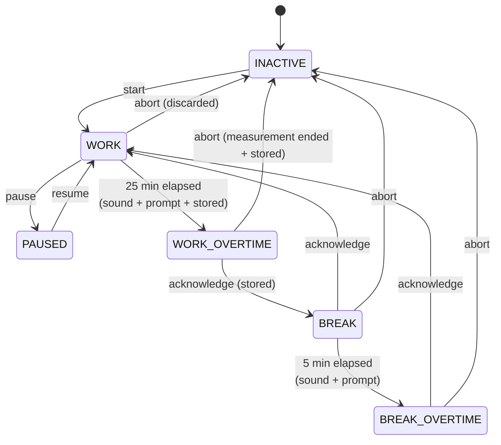

# State machine

## Rules

- A Pomodoro counts **only on completion** of the standard duration, it gets stored during the swith to WORK_OVERTIME.
- Abort from WORK or BREAK → the in-progress phase is discarded.
- Abort and take Break from WORK_OVERTIME → the measurement of the overtime is **ended and stored**
- **BREAK and BREAK_OVERTIME are display states only.** Break time is shown live so the
  user can see an overrun happening, but it is never persisted. Consequently no timeout
  or cutoff rule is needed — a break left running overnight simply produces no data.
- INACTIVE is the start and rest state; nothing is tracked here.

- BREAK can be paused alswell.

